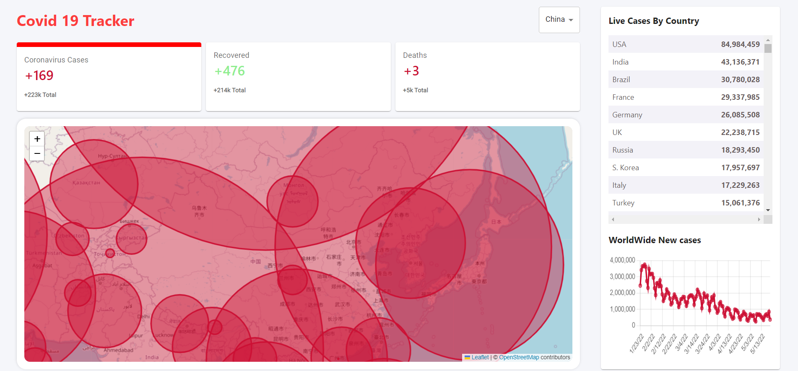

## COVID-19 TRACKER APPLICATION
  This Project is build using ReactJS. This Web Application is fetching the data from an API (https://disease.sh/v3/covid-19/countries)
  
  This is a ```Covid-19 Tracker``` which can display information about the _covid-19 cases, recovery & deaths._ Displaying that information in the form of _Table, Line graph and also the World Map.

  ## Major Concepts Used
   ``` 
   React Hooks, React Components, MATERIAL UI, React State, Flex Box, leaflet and ES7.
   ```
  <h2>ScreenShot</h2>
  <i>This website is Deployed using Firebase!!!</i>
  
  
  Click on the link below to visit the application</br>
   [https://covid-19-tracker-d85bc.web.app/](https://covid-19-tracker-d85bc.web.app/)

